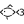

## 
 Hello, welcome to my github account. I'm Amarnath. 

    | <a href="mailto:apatel6ty@protonmail.com?subject=&body=">Personal Email</a> |
    <a href="mailto:amarnathpate2021@fau.edu?subject=&body=">School Email</a> |
    <a href="https://www.linkedin.com/in/amarnath-patel-772b56286/">LinkedIn</a> |
    <a href="https://discordapp.com/users/617140289311735818">Discord</a> |

### Who am I?

I am Amarnath, a student attending university. I took up programming as I always found the science behind computers and computational intelligence very interesting.

Personal "stack"?

 

 &nbsp;
 &nbsp;
 &nbsp;
 &nbsp;
 &nbsp;
 &nbsp;
 &nbsp;
 &nbsp;
 &nbsp;
 &nbsp;

 &nbsp;
 &nbsp;

 

 &nbsp;
 &nbsp;
 &nbsp;

 

 &nbsp;
 &nbsp;
 &nbsp;
 &nbsp;

 

 

I have a couple of repositories here on GitHub, feel free to check them out. I am always open to feedback and suggestions. I usually just go to school and come home, but me and my friends enjoy playing basketball from time to time. I enjoy playing video games and I run a pseudo-server at home (just a 12 year old laptop running a couple of services).

